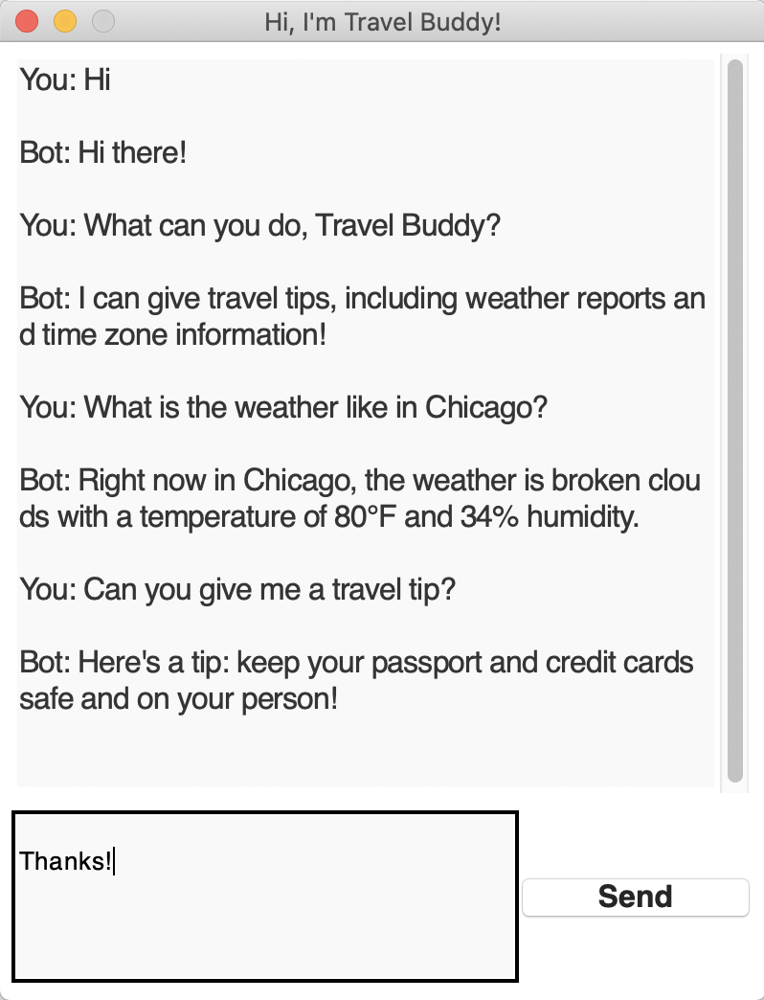

# Travel Buddy: An Intent-Based Travel Chatbot

  

Created using source code from [Data Flair](https://data-flair.training/blogs/python-chatbot-project/)

This generative chatbot uses an LSTM network to detect user intent and produce an appropriate response, including travel tips and current weather information. It also has a GUI (in progress).

**Goals**:
 - Add time zone information responses
 - Finish customizing GUI

**Primary tools used:** Python, TensorFlow, Keras, NLTK, SpaCy, tKinter
